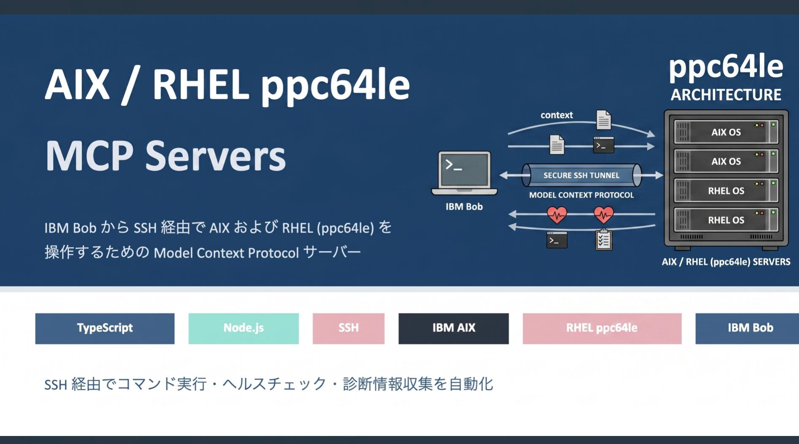

# AIX / RHEL ppc64le MCP Servers

このリポジトリには、IBM Bob から SSH 経由で AIX および RHEL (ppc64le) を操作するための Model Context Protocol (MCP) サーバーが含まれています。

## ご紹介動画

[](https://youtu.be/vO_sZmYnuLo?si=emtaYyy_URIqUB-l)

## 構成

```
aix-rhel-mcp-server/
├── aix-server/                 # IBM AIX 向け MCP サーバー
│   ├── src/
│   ├── build/
│   ├── package.json
│   └── README.md
├── rhel-server/                # RHEL ppc64le 向け MCP サーバー
│   ├── src/
│   ├── build/
│   ├── package.json
│   └── README.md
├── .bob/skills/                # IBM Bob 用スキル定義
├── mcp_setting.json.example    # MCP 設定例
├── README.md
└── README_en.md
```

## 前提条件

- Node.js v18 以上
- npm
- IBM Bob
- 対象サーバーへの SSH アクセス
  - AIX を使う場合: AIX サーバーのホスト名/IP、ユーザー、パスワードまたは秘密鍵
  - RHEL を使う場合: RHEL ppc64le サーバーのホスト名/IP、ユーザー、パスワードまたは秘密鍵

## セットアップ

まず、リポジトリをクローンします。

```bash
git clone https://github.ibm.com/ise-tcc-ai-for-it/aix-rhel-mcp-server.git
cd aix-rhel-mcp-server
```

AIX サーバーを使う場合:

```bash
cd aix-server
npm install
npm run build
```

RHEL ppc64le サーバーを使う場合:

```bash
cd rhel-server
npm install
npm run build
```

両方使う場合は、両方のディレクトリで `npm install` と `npm run build` を実行してください。

## IBM Bob / MCP 設定

プロジェクトルートに `.bob/mcp.json` を作成します。

```bash
mkdir -p .bob
cp mcp_setting.json.example .bob/mcp.json
```

`.bob/mcp.json` の接続情報を環境に合わせて編集してください。AIX と RHEL は同時に登録できます。

```json
{
  "mcpServers": {
    "aix": {
      "command": "node",
      "args": [
        "./aix-server/build/index.js"
      ],
      "env": {
        "AIX_HOST": "your-aix-hostname-or-ip",
        "AIX_PORT": "22",
        "AIX_USERNAME": "your-username",
        "AIX_PASSWORD": "your-password"
      },
      "disabled": false
    },
    "rhel": {
      "command": "node",
      "args": [
        "./rhel-server/build/index.js"
      ],
      "env": {
        "RHEL_HOST": "your-rhel-hostname-or-ip",
        "RHEL_PORT": "22",
        "RHEL_USERNAME": "your-username",
        "RHEL_PRIVATE_KEY": "your-private-key-path"
      },
      "disabled": false
    }
  }
}
```

## 環境変数

### AIX

- `AIX_HOST` 必須: AIX サーバーのホスト名または IP アドレス
- `AIX_PORT` 任意: SSH ポート番号。デフォルトは `22`
- `AIX_USERNAME` 必須: SSH ユーザー名
- `AIX_PASSWORD` 任意: SSH パスワード
- `AIX_PRIVATE_KEY` 任意: SSH 秘密鍵

`AIX_PASSWORD` または `AIX_PRIVATE_KEY` のどちらかが必要です。

### RHEL ppc64le

- `RHEL_HOST` 必須: RHEL サーバーのホスト名または IP アドレス
- `RHEL_PORT` 任意: SSH ポート番号。デフォルトは `22`
- `RHEL_USERNAME` 必須: SSH ユーザー名
- `RHEL_PASSWORD` 任意: SSH パスワード
- `RHEL_PRIVATE_KEY` 任意: SSH 秘密鍵

`RHEL_PASSWORD` または `RHEL_PRIVATE_KEY` のどちらかが必要です。

### Proxy / 踏み台サーバー

AIX/RHEL ともに同じ Proxy 環境変数を使用できます。

- `PROXY_HOST` 任意: Proxy サーバーのホスト名または IP アドレス
- `PROXY_PORT` 任意: Proxy サーバーの SSH ポート番号。デフォルトは `22`
- `PROXY_USERNAME` 任意: Proxy 接続用ユーザー名
- `PROXY_PASSWORD` 任意: Proxy 接続用パスワード
- `PROXY_PRIVATE_KEY` 任意: Proxy 接続用 SSH 秘密鍵

`PROXY_HOST` と `PROXY_USERNAME` が設定されている場合、Proxy 経由で接続します。Proxy 経由の場合は `PROXY_PASSWORD` または `PROXY_PRIVATE_KEY` のどちらかが必要です。

## 利用可能なツール

### AIX

- `execute_aix_command`: 任意の AIX コマンドを実行
- `get_aix_system_info`: OS レベル、ハードウェア、基本構成を取得
- `health_check_aix`: 通常運用/一次切り分け向けの読み取り専用ヘルスチェック
- `list_aix_devices`: デバイス一覧を取得
- `check_aix_errors`: AIX error log を確認
- `get_aix_performance`: CPU、メモリ、ディスクなどの性能情報を取得
- `list_aix_filesystems`: ファイルシステム一覧と使用率を取得
- `get_aix_network_info`: ネットワーク構成を取得
- `list_aix_processes`: プロセス一覧を取得
- `get_aix_users`: ユーザーとグループ情報を取得
- `read_aix_file`: AIX 上のファイルを読み取り
- `collect_snap`: `snap` による診断情報を収集
- `download_snap_file`: snap ファイルを SFTP で取得
- `collect_perfpmr`: `perfpmr` による性能診断情報を独立して収集
- `collect_nmon`: `nmon` による性能データを独立して収集
- `download_perfpmr_file`: perfpmr 出力を SFTP で取得
- `download_nmon_file`: nmon 出力を SFTP で取得
- `analyze_errpt`: `errpt` を条件付きで分析
- `analyze_syslog`: syslog を検索
- `collect_performance_data`: vmstat/iostat/sar などを収集
- `check_dump_config`: dump 設定と dump ファイルを確認
- `get_lpar_config`: LPAR 構成を取得
- `get_kernel_params`: vmo/ioo/schedo/no/nfso などの tunable を取得
- `get_users_and_groups`: ユーザー/グループのサンプル一覧を取得
- `get_path_commands`: PATH 上のコマンド情報を取得
- `get_standard_config_files`: 標準構成ファイルを取得
- `get_system_limits`: ulimit と limits を取得
- `list_filesets`: installed filesets を取得

### RHEL ppc64le

- `execute_rhel_command`: 任意の RHEL コマンドを実行
- `get_rhel_system_info`: OS、kernel、CPU、メモリ、block device 情報を取得
- `health_check_rhel`: 通常運用/一次切り分け向けの読み取り専用ヘルスチェック
- `get_rhel_power_info`: ppc64le / IBM Power 関連情報を取得
- `list_rhel_devices`: block/PCI/CPU/network デバイス情報を取得
- `get_rhel_services`: systemd service 一覧を取得
- `check_rhel_errors`: journal/kernel warning/error を確認
- `get_rhel_performance`: CPU、メモリ、ディスク、プロセス性能情報を取得
- `collect_performance_data`: vmstat/iostat/mpstat/pidstat/sar などを収集
- `list_rhel_filesystems`: filesystem、block device、LVM 情報を取得
- `get_rhel_network_info`: interface、route、socket、DNS、firewalld 情報を取得
- `list_rhel_processes`: プロセス一覧を取得
- `get_rhel_users`: ユーザー、グループ、ログイン、sudo 情報を取得
- `read_rhel_file`: RHEL 上のファイルを読み取り
- `collect_sosreport`: `sos report` による診断情報を収集
- `download_sos_file`: sosreport などを SFTP で取得
- `analyze_journal`: journal を priority/unit/timeframe で分析
- `analyze_syslog`: `/var/log/messages` などを検索
- `check_dump_config`: kdump 設定と vmcore を確認
- `get_kernel_params`: sysctl パラメータを取得
- `get_users_and_groups`: ユーザー/グループのサンプル一覧を取得
- `get_path_commands`: PATH 上のコマンドと RPM 所有情報を取得
- `get_standard_config_files`: 標準構成ファイルを取得
- `get_system_limits`: ulimit、limits.conf、systemd limits を取得
- `list_packages`: RPM package 一覧を取得

## 使用例

IBM Bob で次のように依頼できます。

```text
AIXシステムの情報を取得してください
```

```text
RHEL ppc64le のCPUとOS情報を取得してください
```

```text
RHELの過去24時間のエラーを確認してください
```

```text
AIXで "oslevel -s" コマンドを実行してください
```

```text
RHELで "uname -m" コマンドを実行してください
```

## 使い方の目安

### スキルの使い方

`.bob/skills` には、AIX/RHEL と用途別に6つのスキルを定義しています。IBM Bob には、対象OSと目的を明示して依頼してください。

| 目的 | AIX スキル | RHEL ppc64le スキル |
| --- | --- | --- |
| 通常運用 | `aix_normal_operations.md` | `rhel_normal_operations.md` |
| 障害解析 | `aix_incident_analysis.md` | `rhel_incident_analysis.md` |
| バージョン/構成比較 | `aix_version_comparison.md` | `rhel_version_comparison.md` |

基本の頼み方:

```text
AIX通常運用スキルを使って、対象AIXのヘルスチェックをしてください。
```

```text
RHEL障害解析スキルを使って、対象RHEL ppc64leの一次切り分けをしてください。
```

```text
AIXバージョン比較スキルを使って、aix-server1 と aix-server2 の構成差異を比較してください。
```

```text
RHELバージョン比較スキルを使って、rhel-server1 と rhel-server2 のOS/kernel/RPM差異を比較してください。
```

スキル利用時のポイント:

- 通常運用スキルは読み取り専用確認を中心に使います。
- 障害解析スキルは、まず読み取り専用確認を行い、必要な場合だけ `snap`、`perfpmr`、`nmon`、`sos report` を取得します。
- バージョン比較スキルは2台のMCPサーバー登録が前提です。`.bob/mcp.json` で比較対象を `aix-server1` / `aix-server2` や `rhel-server1` / `rhel-server2` のように分けて登録してください。
- レポート保存を依頼した場合、スキルは `Bob-report` 配下に Markdown レポートを作成する前提です。

### 通常運用

通常運用では、読み取り専用の確認 tool を中心に使います。まず `health_check_aix` または `health_check_rhel` で全体を眺め、気になる領域だけ個別 tool で掘るのがおすすめです。

AIX の通常確認:

```text
AIXの通常ヘルスチェックをしてください。OSレベル、errpt、CPU/メモリ、ファイルシステム、ネットワークを確認して、異常があれば要点だけまとめてください。
```

```text
AIXのファイルシステム使用率と最近のerrptを確認してください。
```

RHEL ppc64le の通常確認:

```text
RHEL ppc64le の通常ヘルスチェックをしてください。failed service、journal warning以上、CPU/メモリ、ファイルシステムを確認してください。
```

```text
RHELのsystemd failed unitsとディスク使用率を確認してください。
```

通常運用で主に使う tool:

- AIX: `health_check_aix`, `get_aix_system_info`, `check_aix_errors`, `get_aix_performance`, `list_aix_filesystems`, `get_aix_network_info`
- RHEL: `health_check_rhel`, `get_rhel_system_info`, `check_rhel_errors`, `get_rhel_performance`, `list_rhel_filesystems`, `get_rhel_network_info`, `get_rhel_services`

### 障害調査

障害調査では、最初に読み取り専用 tool で状況を確認し、必要な場合だけ診断取得 tool を実行します。`snap`, `perfpmr`, `nmon`, `sos report` は時間や負荷、権限の影響があるため、出力先と収集時間を明示してください。

AIX の障害調査:

```text
AIXの障害一次調査をしてください。health_check_aix、errpt詳細、dump設定、性能状況を確認し、次に取得すべき診断データを提案してください。
```

```text
AIXでnmonを10秒間隔で60回、/tmp/mcp-nmon に取得してください。完了後に生成された .nmon ファイル名を教えてください。
```

```text
AIXでperfpmrを300秒、/tmp/mcp-perfpmr に取得してください。完了後に生成物の一覧を表示してください。
```

RHEL ppc64le の障害調査:

```text
RHEL ppc64le の障害一次調査をしてください。health_check_rhel、journal、kdump、性能状況、failed serviceを確認してください。
```

```text
RHELでsos reportを/var/tmpに取得してください。完了後に生成されたファイル名を教えてください。
```

障害調査で主に使う tool:

- AIX: `health_check_aix`, `analyze_errpt`, `analyze_syslog`, `check_dump_config`, `collect_snap`, `collect_perfpmr`, `collect_nmon`, `download_snap_file`, `download_perfpmr_file`, `download_nmon_file`
- RHEL: `health_check_rhel`, `analyze_journal`, `analyze_syslog`, `check_dump_config`, `collect_sosreport`, `download_sos_file`

### 取得ファイルの運用

診断ファイルの出力先は、後から回収しやすい固定ディレクトリに寄せると扱いやすくなります。

- AIX nmon: `/tmp/mcp-nmon`
- AIX perfpmr: `/tmp/mcp-perfpmr`
- AIX snap: `/tmp/mcp-snap`
- RHEL sosreport: `/var/tmp`

取得後は、生成されたファイル名を確認してから `download_*_file` を使ってローカルへ保存してください。

```text
/tmp/mcp-nmon に生成された nmon ファイルを download_nmon_file で取得してください。
```

```text
/tmp/mcp-perfpmr に生成された perfpmr ファイルを download_perfpmr_file で取得してください。
```

## 開発用コマンド

```bash
cd aix-server
npm test
npm run build
```

```bash
cd rhel-server
npm test
npm run build
```

## セキュリティに関する注意事項

- SSH 認証情報は安全に保管してください。
- `.bob/mcp.json` や `.mcp_settings.json` など、認証情報を含むファイルをコミットしないでください。
- 本番環境ではパスワードより SSH 鍵認証を推奨します。
- 対象サーバーでは、必要最小限の権限を持つユーザーを使用してください。
- `execute_*_command` は任意コマンドを実行できるため、利用者と接続先権限を慎重に管理してください。

## トラブルシューティング

### MCP サーバーが起動しない

- `npm run build` が成功していることを確認してください。
- `aix-server/build/index.js` または `rhel-server/build/index.js` が存在することを確認してください。
- `.bob/mcp.json` の JSON 構文と `args` のパスを確認してください。

### SSH 接続エラー

- `AIX_*` または `RHEL_*` のホスト名、ユーザー名、認証情報を確認してください。
- 対象サーバーが SSH 接続を受け入れていることを確認してください。
- Proxy 経由の場合は `PROXY_*` の設定と踏み台から対象サーバーへの到達性を確認してください。
- ファイアウォールやネットワーク経路を確認してください。

### コマンド実行エラー

- 接続ユーザーに必要な権限があることを確認してください。
- AIX/RHEL それぞれのコマンド構文とインストール済みパッケージを確認してください。
- `sos report`, `snap`, kdump など一部の診断コマンドは root 権限または追加パッケージが必要な場合があります。

## 注意事項

本コードは現状有姿 (AS-IS) で公開しており、動作保証はありません。検証環境などで十分に確認したうえで、自己責任でご利用ください。
