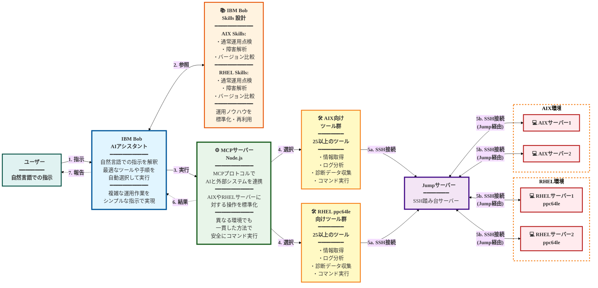

#### IBM Bob AIアシスタント アーキテクチャ図 : 主要技術要素

## 図の説明

### データフロー（左から右へ）
1. **ユーザー → IBM Bob**: 自然言語で指示
2. **IBM Bob ⇄ Skills**: 運用手順・調査フローを参照
3. **IBM Bob → MCPサーバー**: 標準化されたプロトコルで接続
4. **MCPサーバー → ツール群**: AIXまたはRHEL向けツールを選択
5. **ツール群 ⇄ サーバー**: Jumpサーバー経由でSSH接続し、コマンド実行・結果取得
   - 5a. ツール群からJumpサーバーへSSH接続
   - 5b. JumpサーバーからAIX/RHELサーバーへSSH接続（踏み台経由）
6. **MCPサーバー → IBM Bob**: 結果を返却（点線）
7. **IBM Bob → ユーザー**: 最終結果を報告（点線）

### コンポーネント
- **青色**: AIアシスタント（中核）
- **オレンジ色**: Skills設計（ノウハウ管理）
- **緑色**: MCPサーバー（実行エンジン）
- **紫色**: Jumpサーバー（SSH踏み台）
- **黄色**: ツール群（具体的なアクション）
- **赤色**: 対象サーバー（AIX/RHEL）
- **水色**: ユーザー

### 表示方法
- **VS Code**: Markdown Preview Enhanced拡張機能をインストール
- **GitHub**: このファイルをプッシュすると自動的に図が表示されます
- **オンラインツール**: https://mermaid.live/ にコードを貼り付けて表示・エクスポート可能

### 文字サイズについて
- フォントサイズを18pxに設定
- 重要な部分を太字（`<b>`タグ）で強調
- 線の太さも増加（3-4px）して視認性を向上
